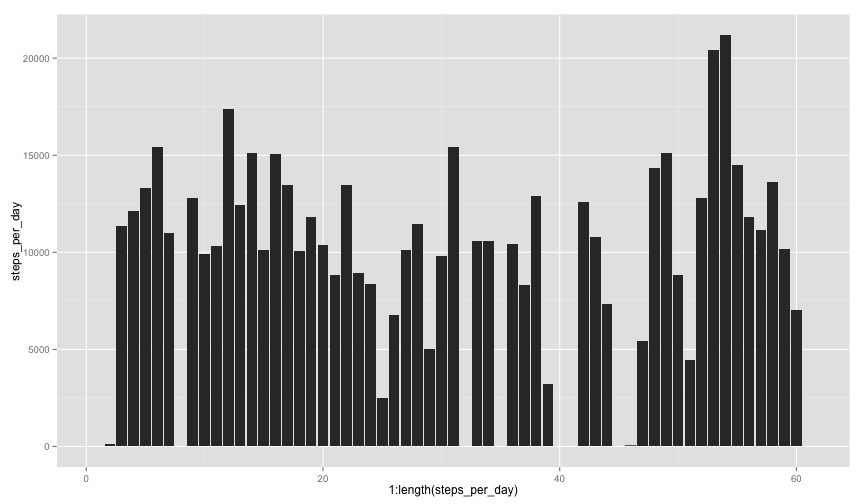
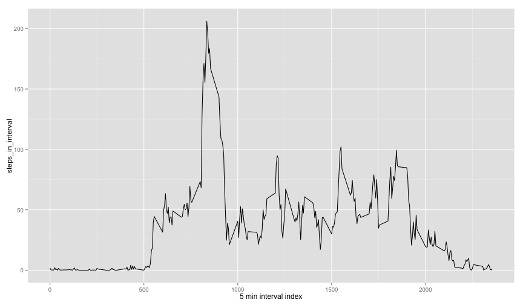
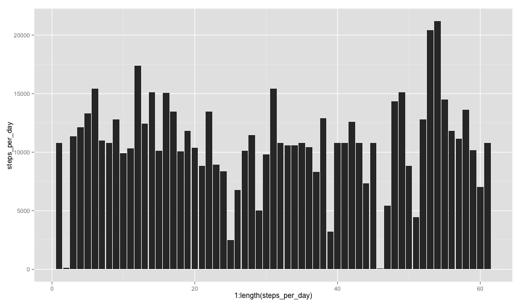
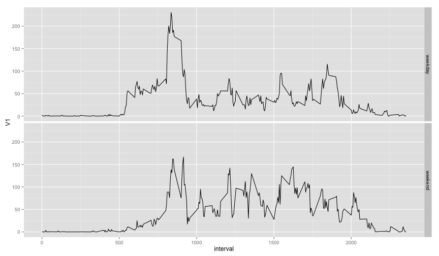

We will use lubridate for easier date maniuplation, ggplot for graphing and plyr 
for simpler data manuiplation.


```r
install.packages('lubridate')
library(lubridate)
library(ggplot2)
library(plyr)
```

## Loading and preprocessing the data

After decompressing the activity.zip, a file names activity.csv was output.

```r
dataf = read.csv('activity.csv', stringsAsFactors=F)
dataf$date = strptime(dataf$date, "%Y-%m-%d" )
```

## What is mean total number of steps taken per day?
Let's draw a histogram, we'll use qplot inference to draw us the histogram of dates


```r
steps_per_day = tapply(dataf$steps,
                       yday(dataf$date),
                       function(x) sum(x, na.rm=T))
qplot(1:length(steps_per_day), steps_per_day, geom='bar', stat='identity')
```

 


```r
mean(steps_per_day)
```

```
## [1] 9354.23
```

```r
median(steps_per_day)
```

```
## [1] 10395
```

## What is the average daily activity pattern?

```r
steps_in_interval = tapply(dataf$steps, (dataf$interval), function(x) mean(x, na.rm=T))

qplot(as.numeric(names(steps_in_interval)),
      steps_in_interval,
      geom='path',
      stat='identity', xlab='5 min interval index')
```

 

```r
which.max(steps_in_interval)
```

```
## 835 
## 104
```

## Imputing missing values

```r
summary(dataf)
```

```
##      steps             date               interval     
##  Min.   :  0.00   Min.   :2012-10-01   Min.   :   0.0  
##  1st Qu.:  0.00   1st Qu.:2012-10-16   1st Qu.: 588.8  
##  Median :  0.00   Median :2012-10-31   Median :1177.5  
##  Mean   : 37.38   Mean   :2012-10-31   Mean   :1177.5  
##  3rd Qu.: 12.00   3rd Qu.:2012-11-15   3rd Qu.:1766.2  
##  Max.   :806.00   Max.   :2012-11-30   Max.   :2355.0  
##  NA's   :2304
```

```r
sum(is.na(dataf$steps))
```

```
## [1] 2304
```

The strategy we will use for imputing is getting the average time in that interval
throughout the data and put that instead of the missing values.


```r
dataf_imputed = dataf
intervals_str = as.character(dataf_imputed[is.na(dataf_imputed$steps),]$interval)
imputed_values = steps_in_interval[intervals_str]
dataf_imputed[is.na(dataf_imputed$steps),]$steps = imputed_values

steps_per_day = tapply(dataf_imputed$steps,
                       yday(dataf_imputed$date),
                       function(x) sum(x, na.rm=T))
qplot(1:length(steps_per_day), steps_per_day, geom='bar', stat='identity')
```

 


```r
mean(steps_per_day)
```

```
## [1] 10766.19
```

```r
median(steps_per_day)
```

```
## [1] 10766.19
```
Imputing increased the mean of the data. My guess here is this is caused because 
the missing data happened at times where the number of steps was higher than the 
global average. that's why the mean increased. I haven't investiaged this though.


## Are there differences in activity patterns between weekdays and weekends?

```r
dataf_days = weekdays(dataf_imputed$date)
dataf_imputed$day_type = factor(ifelse(dataf_days == 'Saturday'
                                | dataf_days == 'Sunday', 'weekend', 'weekday'))


long_data = ddply(dataf_imputed, .(interval, day_type), function(x) mean(x$step))
ggplot(long_data, aes(x=interval, y=V1)) + geom_path() + facet_grid(day_type ~ .)
```

 
Yes there is difference. the weekend is more distributed throughout the day. And the
peak of movement at around 805 isn't as aggressive as in the weekdays.
